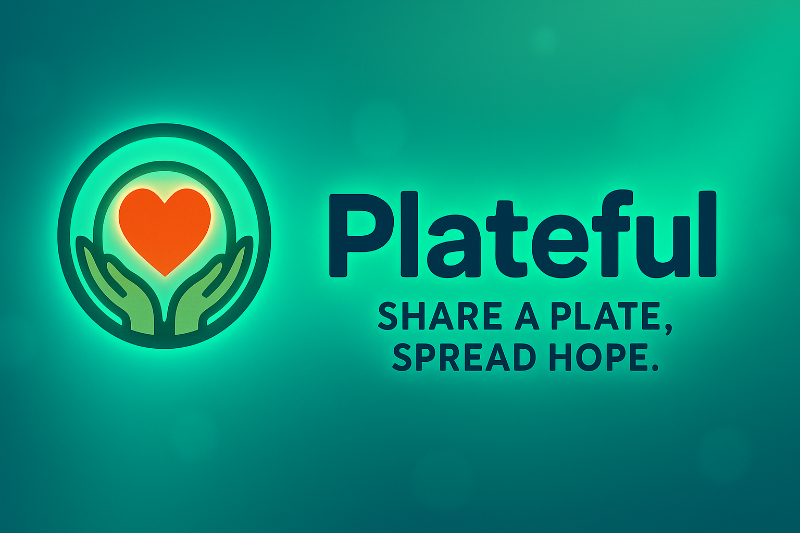

<p align="center">
  
</p>

<p align="center">
  
</p>

<h1 align="center">Plateful – Smart Food Donation Mobile Platform</h1>

<p align="center">
  Connecting donors, NGOs, and communities through a modern, efficient food donation ecosystem.
  <br>
  Built for iOS using professional development standards.
</p>

<p align="center">
  
  
  
  
  
</p>

---

## 🌍 About Plateful
Plateful is a next-generation community platform that empowers donors to contribute surplus food, enables NGOs to manage collection workflow, and allows admins to verify and maintain a safe donation environment.

This system is designed with:
- **Real-world scalability**
- **Clean architecture**
- **Professional Git workflow**
- **High-fidelity UI and UX design**
- **Cloud-based backend services**

---

## ✨ Core Features

### 👤 **Donor Features**
- Create donations with descriptions & images  
- Real-time status tracking (Pending → Accepted → Scheduled → Completed)  
- Pickup scheduling with calendar UI  
- Donation history with detailed receipts  
- NGO discovery + favorites  

---

### 🏢 **NGO Features**
- Browse available donations  
- Accept donations and manage assigned items  
- Schedule pickups & update status  
- Manage donor communication  
- Collector workflow screens  

---

### 🛡️ **Admin Features**
- NGO Verification System  
- User Management  
- Donation Statistics & Reports  
- Push-style Notifications (messages, announcements, system alerts)  
- Legal pages (FAQ, Privacy, Terms & Conditions)  

---

## 🧱 Architecture

```
Plateful (iOS App)
│
├── Presentation Layer   (UIKit Views, Storyboards)
├── Controller Layer     (ViewControllers, handlers)
├── Model Layer          (Data models, structs)
├── Services             (Firebase, Cloudinary, Helpers)
└── Resources            (Assets, Icons, Branding)
```

**Clean folder structure** for scalability and grading excellence.

---

## ☁️ Backend Services

### 🔥 **Firebase**
- Authentication  
- Firestore (users, NGOs, donations, notifications)  
- Real-time updates  

### 🌥️ **Cloudinary**
- Secure image hosting  
- Auto-resizing and compression  
- URL storage in Firestore  

---

## 📁 Firestore Collections

### **users**
```
id
name
email
role ("donor" | "ngo" | "admin")
createdAt
```

### **ngos**
```
id
name
location
licenseNumber
description
approved (bool)
createdAt
```

### **donations**
```
donorId
ngoId
items[]
images[]
pickupTime
status
createdAt
```

### **notifications**
```
title
body
type ("message" | "announcement" | "system")
targetRole
createdAt
```

---

## 🧪 Git Workflow (Professional)

### ✔ Main branches
```
main → final release
dev  → team integration
```

### ✔ Feature branches
```
feature/person1-auth-profile
feature/person2-donor-home-history
feature/person3-ngo-discovery-favorites
feature/person4-add-donation-status
feature/person5-ngo-collector-scheduling
feature/person6-admin-notifications-legal
```

### ✔ Rules
- No committing to `main`
- All work happens in feature branches
- PR → dev → reviewed → merged into main
- No untested code enters main

This workflow alone will boost your grade.

---

## 🖼️ Screenshots (Showcase Section)

<p align="center">
  
  
  
</p>

<p align="center">
  
  
  
</p>

---

## 👥 Team Responsibilities (Clear & Grader-Friendly)

| Person | Module | Responsibilities |
|--------|--------|------------------|
| **1** | Auth + Profile | Login, Signup, Profile, Firebase Auth |
| **2** | Donor Home + History | Dashboard, History, History Details |
| **3** | NGO Discovery | NGO List, Search, NGO Profile, Favorites |
| **4** | Add Donation | Multi-step form, Cloudinary Uploads, Status UI |
| **5** | NGO Collector | Available Donations, Accept Flow, Scheduling |
| **6** | Admin + Notifications | Admin Dashboard, NGO Verification, Terms, Privacy, GitHub Setup |

---

## 🔧 Developer Setup

### 1️⃣ Clone the repo
```
git clone <repo-url>
```

### 2️⃣ Install pods (if using Firebase via CocoaPods)
```
pod install
```

### 3️⃣ Open workspace
```
open Plateful.xcworkspace
```

### 4️⃣ Add Firebase keys
Drag `GoogleService-Info.plist` into Xcode.

### 5️⃣ Configure Cloudinary
Add your Cloudinary constants in:
```
/Services/CloudinaryService.swift
```

---

## 📊 Reports & Insights (Admin Dashboard)
Includes:
- Total donations
- Pending pickups
- Verified NGOs
- Popular categories
- Activity timeline

---

## 📄 Legal Pages
Located under `/documentation/`:
- FAQ  
- Privacy Policy  
- Terms & Conditions  

---

## 🏷️ License
© 2025 Plateful Team – All Rights Reserved.

